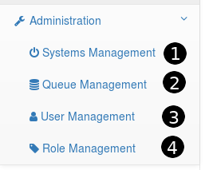

Now that you have Beer Garden up and running it is time to explore the UI.

=== Navigation

image::navigation-user.png[Navigation User]

Non-admin users are provided a basic list of areas where they can navigate to.

. Toggle Drop down to view all Systems (Plugins) deployed
. Links to that specific System
. Link to page with all deployed commands
. Link to page to view all Requests received by Beer Garden
. Link to the scheduler tool for setup automated requests

Admin users have additional areas where they can navigate to.

. Administrative page to start/stop/rescan/delete connected systems
. Administrative page to manage the Queues that Systems are listening to
. Administrative page to manage user permissions
. Administrative page to create new roles

=== Systems

image::complex_system.png[Complex System]

As a Plugin Developer you have the ability to provide information that will be present to
the user.

. Label of the plugin (Developer Provided)
. Version of Plugin (Developer Provided)
. Brief description of the plugin (Developer Provided)
. Total number of commands contained within Plugin
. Total number of instances of this plugin version that are running
. Link the commands page for this Plugin

=== Commands

Image

=== Requests

Image

=== Scheduler

Image

=== Administration

Image