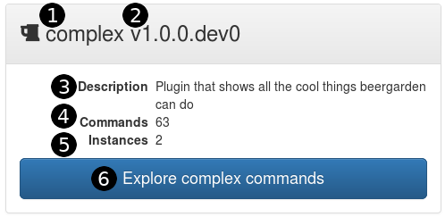

Now that you have Beer Garden up and running it is time to explore the UI.

=== Systems

At a glance, we try to give the user as much information about what is currently connected

=== Commands

Image

=== Requests

Image

=== Scheduler

Image

=== Administration

Image