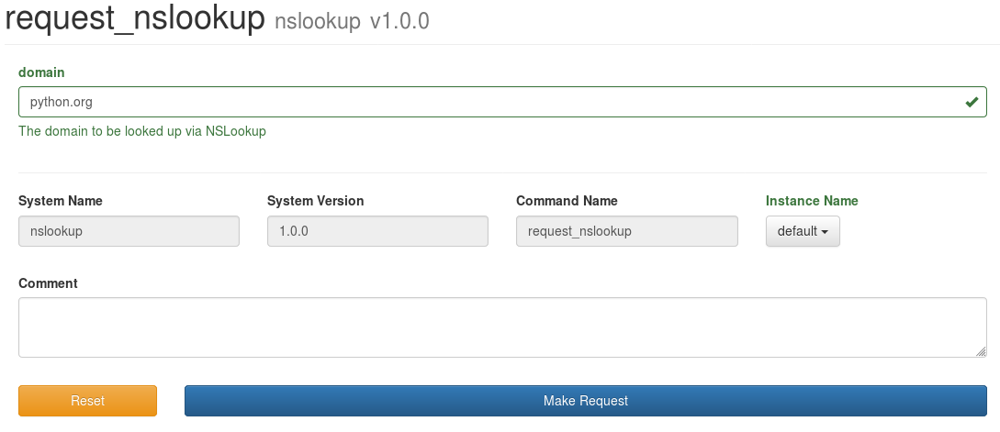
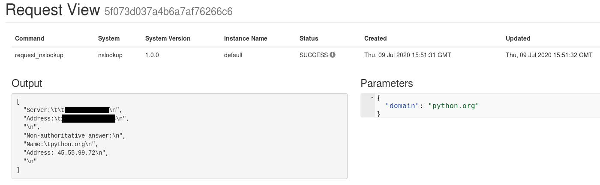

== Example 2: Running Shell Commands
:imagesdir: ../../images/

For this example, we are going to explore kicking off Shell Commands from Beer Garden plugins. To accomplish
this we have to select a Shell Command that best fits your environment. For this example we will use nslookup
because it is available on most operating systems (Mac OS, Ubuntu, Windows, Centos).

=== Execute Locally

[source, bash]
.Example
----
nslookup python.org
----

Go ahead and run this in the command line to ensure that it works properly in your environment.
You should get something like the following

[source, bash]
.Example
----
Server:     <DNS Server>
Address:    <DNS Server Address>

Non-authoritative answer:
Name:    python.org
Address: 45.55.99.72

----

=== Create Base Class

Like the first example, lets build this out into a basic Python class.  For this example, we will provide
the raw output but feel free to get creative with parsing the output.

[source,python]
.nslookup_plugin.py
----

import subprocess

class NSLookupClient:

    def request_nslookup(self, domain):
        process = subprocess.Popen(['nslookup', domain],
                     stdout=subprocess.PIPE)

        print(process.stdout.readlines())

def main():
	client = NSLookupClient()
	client.request_nslookup("python.org")

if __name__ == "__main__":
	main()
----

=== Convert to Beer Garden Plugin

Instead of creating a new class, let convert the function directly into a Beer Garden system command.
That way we can expose this function in the UI.

[source,python]
.nslookup_plugin.py
----
from brewtils import command, system, parameter, Plugin
import subprocess

@system
class NSLookupClient:

    @command
    #(1)
    @parameter(
        key="domain", #(2)
        type="String", #(3)
        description="The domain to be looked up via NSLookup", #(4)
        default="python.org", #(5)
    )
    def request_nslookup(self, domain):
        process = subprocess.Popen(['nslookup', domain],
                     stdout=subprocess.PIPE)
        return process.stdout.readlines()

def main():
	client = NSLookupClient()

	plugin = Plugin(
        client,
        name='nslookup',
        version='1.0.0',
        description='Runs Shell Command NSLookup',
        bg_host="<HOST>",
        bg_port=<PORT>,
        ssl_enabled=<SSL_ENABLED>,
    )

    plugin.run()

if __name__ == "__main__":
	main()
----

<1> The `@parameter` decorator identifies that the command has input parameters
<2> The `key` field marks the input variable to map to
<3> the `type` field marks the valid input type
<4> The `description` field marks what will be displayed on the UI under the parameter
<5> The `default` field will pre-populate the UI as the default input parameter

We will go over more complex forms in Example 5 to review the various input types.

Now let's run the code and check it out on the Beer Garden UI.

    python nslookup_plugin.py

We can see that a field is now populated on the `Request Page` for the command and that `python.org` is
pre-populated in the form. When you click `Make Request` you should get a similar result to the following.

We can see the raw response from the command we executed in the `Output` field.

=== Conclusion

This has been a basic example of how you can use Beer Garden to run Shell Script commands. You can
expand on this exampled to run bash files or any other command you have access to in your terminal.

