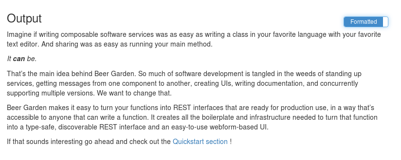
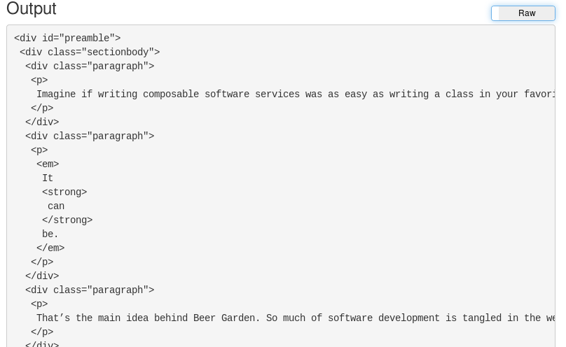

== Example 3: Web Scraping
:imagesdir: ../../images/

For this example we are going to explore Web Scraping. There are many different ways to accomplish
this task in Python. For our examples we are going to use two additional libraries,
link:https://requests.readthedocs.io/en/master/[Requests] and
link:https://www.crummy.com/software/BeautifulSoup/[BeautifulSoup].

Before we start, please ensure these libraries are installed:

[source,bash,subs="attributes"]
----
pip install beautifulsoup4 requests
----

=== Write Base Class

We are going to utilize the Beer-Garden.io website as our source. So like before, let's build up a base
class object that can interact with the Python.org website to pull some attributes. For our example, we
will be scraping the Preamble section of the Beer Garden homepage.

[source,python]
.web_scraping_plugin.py
----
import requests
from bs4 import BeautifulSoup

class WebScrapingClient:

    def download_url(self, url):
        page = requests.get(url)
        soup = BeautifulSoup(page.content, 'html.parser')
        return soup

    def extract_id(self, url, id):
        soup = self.download_url(url)
        return soup.find(id=id).prettify()

def main():
    client = WebScrapingClient()
    preamble = client.extract_id("https://www.beer-garden.io", "preamble")
    print(preamble)

if __name__ == "__main__":
	main()
----

=== Convert to Beer Garden Plugin

Just like the previous examples, we now want to convert this Class into a Beer Garden Plugin, but this
time we want to return the output as an HTML object.

[source,python]
.web_scraping_plugin.py
----
import requests
from bs4 import BeautifulSoup
from brewtils import command, system, parameter, Plugin

@system
class WebScrapingClient:

    def download_url(self, url):
        page = requests.get(url)
        soup = BeautifulSoup(page.content, 'html.parser')
        return soup

    @command(output_type="HTML") # <1>
    @parameter(
        key="url",
        type="String",
        description="The URL to be looked up via Web Scraper",
        default="https://www.beer-garden.io",
    )
    @parameter(
        key="id",
        type="String",
        description="The element ID to be extracted",
        default="preamble",
    )
    def extract_id(self, url, id):
        soup = self.download_url(url)
        return soup.find(id=id).prettify()

def main():
    client = WebScrapingClient()

    plugin = Plugin(
        client,
        name='WebScraper',
        version='1.0.0',
        description='Scrapes requested website with BS4',
        bg_host="<HOST>",
        bg_port=<PORT>,
        ssl_enabled=<SSL_ENABLED>,
    )

    plugin.run()

if __name__ == "__main__":
	main()
----

<1> The `output_type` field can be set to HTML, JSON, or STRING. This field alters how the UI renders
the Output Cell

Now that everything is ready, let's run this and invoke the command in the UI.

    python web_scraping_plugin.py

Since we changed the output type to HTML, the UI provides two options for viewing the output cell

=== Formatted

Beer Garden UI renders the HTML from the output cell if it is valid HTML.

=== Raw

If the user wants to see the raw format of the results, they just have to toggle the `Formatted`
option to `Raw`

=== Conclusion

This was a basic example of how you can use Beer Garden to scrape data from web pages. You might
expand upon this example to perform daily dumps of data sets that are only published via static HTML pages.