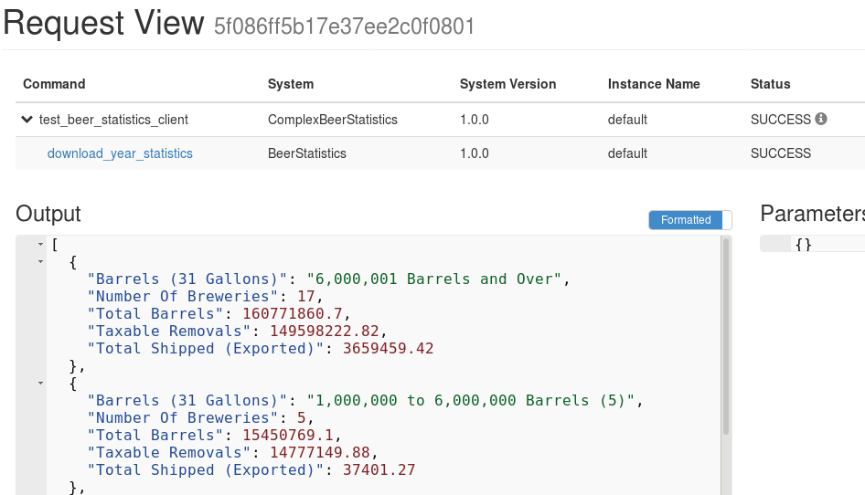
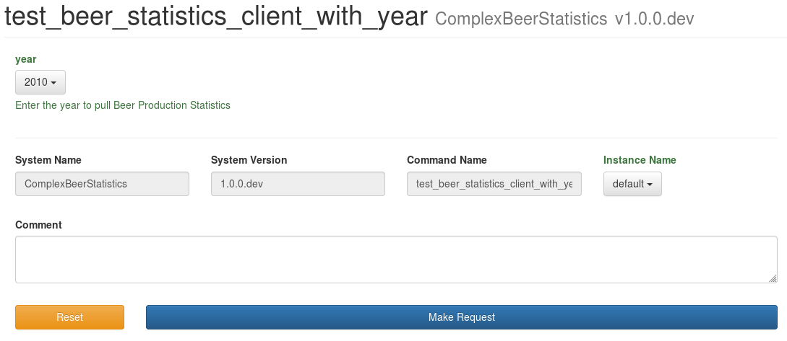
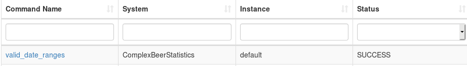
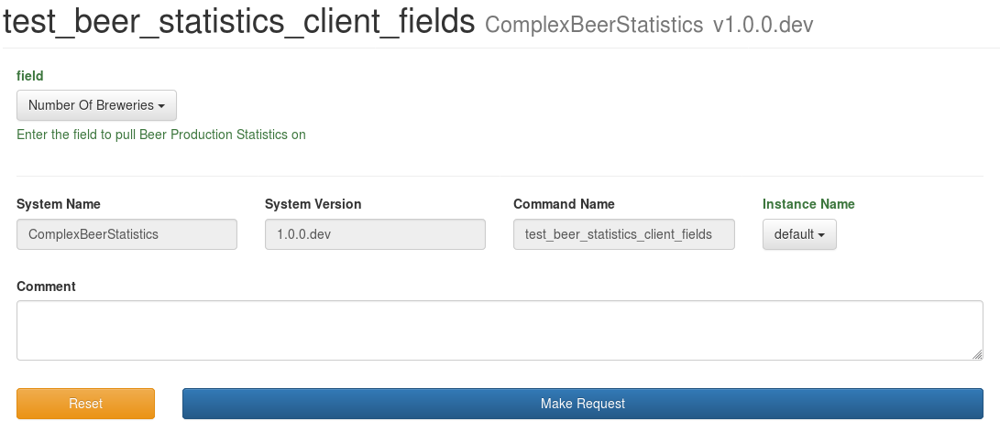
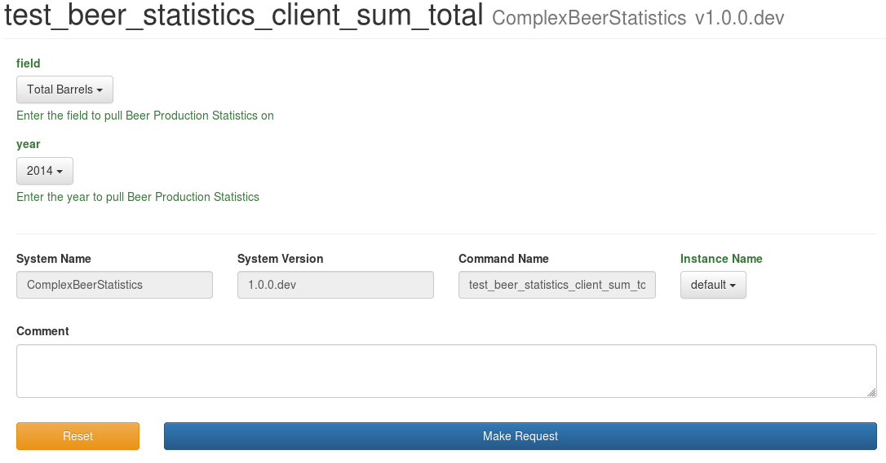
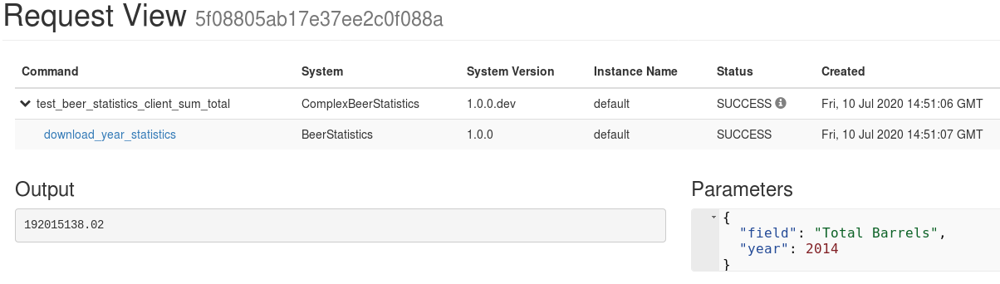

== Example 5: User Forms and Advanced Features
:imagesdir: ../../images/

We have covered the basics of how to create Beer Garden Plugins with a variety of Input and Output Types.
This Example will merge these concepts together while creating more complex User Forms.

For this example you will need the Beer Statistics Plugin running from the last example.

    python beer_statistics_plugin.py

We are going to create a new plugin that accomplishes the following tasks:

. Connect to the Beer Statistics Plugin and spawn a child request
. Dynamically creates a Drop Down for Year Range
. Dynamically creates a Drop Down for Field Summary Option
. Creates a request that finds the Sum Total for one field from the Beer Statistics Plugin

We are going to work down this list in order for creating our new plugin.

=== Connect to Another Client

In this snippet we are going to create a System Client connection with the Plugin to allow access
to remote commands.

[source,python]
.complex_beer_statistics_plugin.py
----

from brewtils import parameter, command, system, SystemClient, Plugin

@system
class ComplexBeerStatisticsClient:

    def __init__(self, params):
        # (1)
        self.beer_statistics_client = SystemClient(system_name="BeerStatistics", **params)

    @command(output_type="JSON")
    def test_beer_statistics_client(self):
        # (2)
        results = self.beer_statistics_client.download_year_statistics(2010)
        # (3)
        return results.output

def main():

    # (4)
    connection_params = {"bg_host":"<HOST>",
                         "bg_port":<PORT>,
                         "ssl_enabled":False}

    client = ComplexBeerStatisticsClient(connection_params)

    plugin = Plugin(
        client,
        name='ComplexBeerStatistics',
        version='1.0.0.dev', # (5)
        description='Parses data from TTB.gov on Brewer Production sizes of Beer',
        **connection_params
    )

    plugin.run()

if __name__ == "__main__":
    main()

----

<1> Developers can reference other clients through the `SystemClient` class.
<2> All commands on `SystemClient` can be referenced directly like a standard Class Function
<3> The output of the `Command` is a `Request`. Developers can put the raw output from the `output` field.
<4> For ease of use, we are passing forward connection parameters so we only have to define it once
<5> Because we are going to start and stop this plugin multiple times, using the `.dev` tag on the version
will not require version increases while you are developing the plugin.

Let's run this Plugin and see what happens

    python complex_beer_statistics_plugin.py

We can see that a child request is spawned when invoking this command. If you click on the hyperlink
for `download_year_statistics` you can see the input/output for that command.

=== Building Dynamic Dropdown List

In this snippet we want to use the `valid_year_range` command output at the input to the Choices list that will be
used to render the Form. This is helpful when variables are Environment specific or Static Lists.

[source,python]
.complex_beer_statistics_plugin.py
----

from brewtils import parameter, command, system, SystemClient, Plugin

@system
class ComplexBeerStatisticsClient:

    def __init__(self, params):
        self.beer_statistics_client = SystemClient(system_name="BeerStatistics", **params)

    @command(output_type="JSON")
    def test_beer_statistics_client(self):
        results = self.beer_statistics_client.download_year_statistics(2010)
        return results.output

    # (1)
    @command()
    def valid_year_range(self):
        return list(range(2008, 2019))

    @command(output_type="JSON")
    @parameter(
        key="year",
        type="Integer",
        description="Enter the year to pull Beer Production Statistics",
        choices={"type": "command", "value": "valid_year_range", "display": "select"},  # (2)
    )
    def test_beer_statistics_client_with_year(self, year):
        results = self.beer_statistics_client.download_year_statistics(year=year)
        return results.output

def main():

    connection_params = {"bg_host":"<HOST>",
                         "bg_port":<PORT>,
                         "ssl_enabled":False}

    client = ComplexBeerStatisticsClient(connection_params)

    plugin = Plugin(
        client,
        name='ComplexBeerStatistics',
        version='1.0.0.dev',
        description='Parses data from TTB.gov on Brewer Production sizes of Beer',
        **connection_params
    )

    plugin.run()

if __name__ == "__main__":
    main()

----

<1> We created the `valid_year_range` command that returns back the values we want to use on our form.
<2> Here we tell the `Parameter` field that it needs to use a `Command` of name `valid_year_range` to
limit the choices. By setting the `display` property to `select`, it will display the field as a drop down.

So now lets run this Plugin and see what happens

    python complex_beer_statistics_plugin.py

When the Form is loaded it doesn't have the Choices list, so it is rendered as a standard input field,
once the command is executed the options are populated and limit input to those values.

We can then go to the `Requests` page and see that the `Request` was submitted to invoke that command
to populate the form.

=== Building Dynamic Dropdown List off Plugin Results

In this update to the snippet we are going to use the `Choices` field to specify another Command for
the choices list. This is helpful when variables are managed remotely.

[source,python]
.complex_beer_statistics_plugin.py
----
from brewtils import parameter, command, system, SystemClient, Plugin

@system
class ComplexBeerStatisticsClient:

    def __init__(self, params):
        self.beer_statistics_client = SystemClient(system_name="BeerStatistics", **params)

    @command(output_type="JSON")
    def test_beer_statistics_client(self):
        results = self.beer_statistics_client.download_year_statistics(year=2010)
        return results.output

    @command()
    def valid_date_ranges(self):
        return list(range(2008, 2019))

    @command(output_type="JSON")
    @parameter(
        key="year",
        type="Integer",
        description="Enter the year to pull Beer Production Statistics",
        choices={"type": "command", "value": "valid_date_ranges", "display": "select"},
    )
    def test_beer_statistics_client_with_year(self, year):
        results = self.beer_statistics_client.download_year_statistics(year=year)
        return results.output

    # (1)
    @command()
    def valid_summary_fields(self):
        # Grabbing a random Statistic
        results = self.beer_statistics_client.download_year_statistics(year=2010)

        # Parsing the first record for Fields we could run Sum Totals on
        if results.output:
            output = json.loads(results.output)
            fields = list()
            for key in output[0]:
                if isinstance(output[0][key], (float, int)):
                    fields.append(key)

            return fields

        return []

    @command(output_type="STRING")
    @parameter(
        key="field",
        type="String",
        description="Enter the field to pull Beer Production Statistics on",
        choices={"type": "command", "value": "valid_summary_fields", "display": "select"}, # (2)
    )
    def test_beer_statistics_client_fields(self, field):
        return field

def main():

    connection_params = {"bg_host":"<HOST>",
                         "bg_port":<PORT>,
                         "ssl_enabled":False}

    client = ComplexBeerStatisticsClient(connection_params)

    plugin = Plugin(
        client,
        name='ComplexBeerStatistics',
        version='1.0.0.dev',
        description='Parses data from TTB.gov on Brewer Production sizes of Beer',
        **connection_params
    )

    plugin.run()

if __name__ == "__main__":
    main()

----

<1> We are going to call the `SystemClient` for Beer Statistics and pull back a single record, then find all
of the fields we can run a Sum Total Summary on.
<2> Here we set that `Command` as the choices just like the previous step

So now lets run this Plugin and see what happens

    python complex_beer_statistics_plugin.py

Just like before, this kicked off a `Command` in the background to pull back the valid list of Fields
that be entered into the `Request`.

=== Building Sum Total Function

Now we want to combine the three techniques we just learned into a single function that can determine the
sum total across all rows in the spread sheet.

[source,python]
.complex_beer_statistics_plugin.py
----
from brewtils import parameter, command, system, SystemClient, Plugin
import json

@system
class ComplexBeerStatisticsClient:

    def __init__(self, params):
        self.beer_statistics_client = SystemClient(system_name="BeerStatistics", **params)

    @command(output_type="JSON")
    def test_beer_statistics_client(self):
        results = self.beer_statistics_client.download_year_statistics(year=2010)
        return results.output

    @command()
    def valid_date_ranges(self):
        return list(range(2008, 2019))

    @command(output_type="JSON")
    @parameter(
        key="year",
        type="Integer",
        description="Enter the year to pull Beer Production Statistics",
        choices={"type": "command", "value": "valid_date_ranges", "display": "select"},
    )
    def test_beer_statistics_client_with_year(self, year):
        results = self.beer_statistics_client.download_year_statistics(year=year)
        return results.output

    @command()
    def valid_summary_fields(self):
        # Grabbing a random Statistic
        results = self.beer_statistics_client.download_year_statistics(year=2010)

        # Parsing the first record for Fields we could run Sum Totals on
        if results.output:
            output = json.loads(results.output)
            fields = list()
            for key in output[0]:
                if isinstance(output[0][key], (float, int)):
                    fields.append(key)

            return fields

        return []

    @command(output_type="STRING")
    @parameter(
        key="field",
        type="String",
        description="Enter the field to pull Beer Production Statistics on",
        choices={"type": "command", "value": "valid_summary_fields", "display": "select"},
    )
    def test_beer_statistics_client_fields(self, field):
        return field

    @command(output_type="STRING")
    @parameter(
        key="field",
        type="String",
        description="Enter the field to pull Beer Production Statistics on",
        choices={"type": "command", "value": "valid_summary_fields", "display": "select"},
    )
    @parameter(
        key="year",
        type="Integer",
        description="Enter the year to pull Beer Production Statistics",
        choices={"type": "command", "value": "valid_date_ranges", "display": "select"},
    )
    def test_beer_statistics_client_sum_total(self, field, year):
        results = self.beer_statistics_client.download_year_statistics(year=year)

        # Parsing the first record for Fields we could run Sum Totals on
        if results.output:
            total = 0
            output = json.loads(results.output)
            for stat in output:
                total += stat[field]
            return round(total, 2)

        return None

def main():

    connection_params = {"bg_host":"<HOST>",
                         "bg_port":<PORT>,
                         "ssl_enabled":False}

    client = ComplexBeerStatisticsClient(connection_params)

    plugin = Plugin(
        client,
        name='ComplexBeerStatistics',
        version='1.0.0.dev',
        description='Parses data from TTB.gov on Brewer Production sizes of Beer',
        **connection_params
    )

    plugin.run()

if __name__ == "__main__":
    main()

----

So now lets run this Plugin and see what happens

    python complex_beer_statistics_plugin.py

The form for the Request has two dynamic fields that are required to be populated with valid input
for the command to execute. Try inputting something incorrect here and see what happens.

After we execute the request we can see that it spawned a Child Request and return back just the
Sum Total of the field. If you want to verify, go into the child Request and count up the values.

=== Conclusion

This has been a basic example of how you can use Beer Garden to dynamically generate Forms and invoke
other Plugins for results. We would challenge you to writing your plugins with a single objective in place.
Then develop your complex logic and orchestration on top of those basic function plugins. that way it is
easier to debug your code from the UI and manage incremental release of Plugins.

