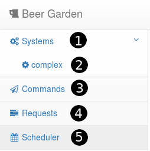
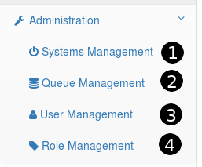
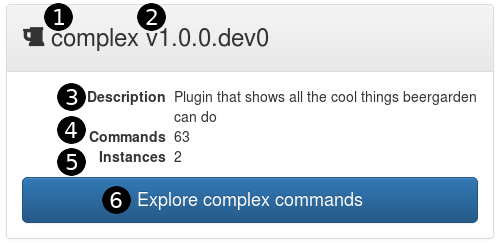
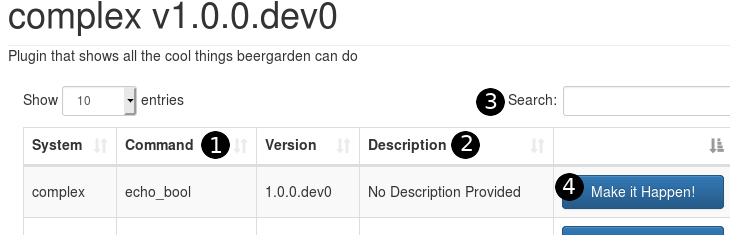
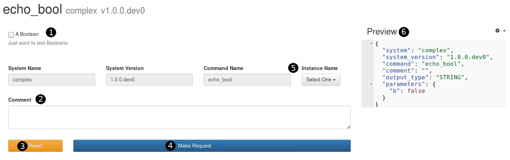
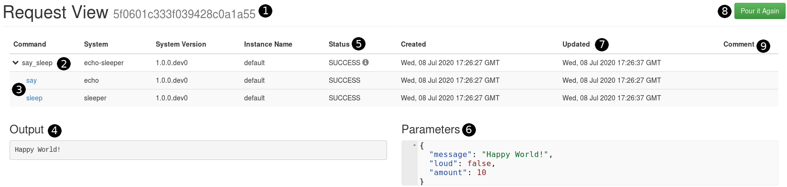
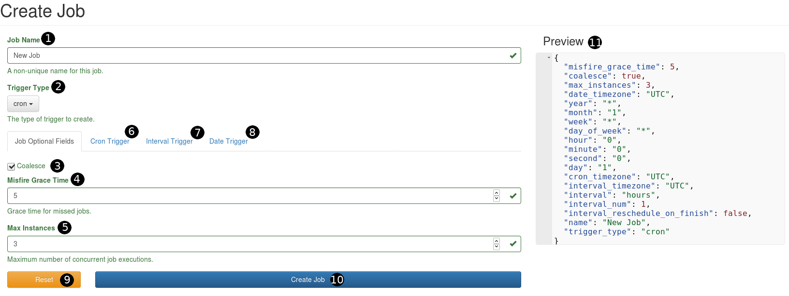

:imagesdir: ../../images/

== UI Orientation

Now that you have Beer Garden up and running it is time to explore the UI.

=== Navigation

Non-admin users are provided a basic list of areas where they can navigate to.

. `Systems` - Toggles the drop down to view all systems deployed
. `complex` - Links to that specific system
. `Commands` - Link to page with all deployed commands
. `Requests` - Link to page to view all requests received by Beer Garden
. `Scheduler` - Link to the scheduler tool for setup automated requests

==== Admin Only

Admin users have additional areas where they can navigate to.

. `System Management` - Administrative page to start/stop/rescan/delete connected systems
. `Queue Management` - Administrative page to manage the queues that systems are listening to
. `User Management` - Administrative page to manage user permissions
. `Role Management` - Administrative page to create new roles

=== Systems

As a developer you have the ability to provide information that will be present to
the user.

. Label of the system (Developer Provided)
. Version of system (Developer Provided)
. Brief description of the system (Developer Provided)
. Total number of commands contained within system
. Total number of instances of this system/version that are running
. Link the commands page for this system

=== Commands

The base page is the same for both system specific commands and the global command page
(commands on navigation panel). This page will display all of the available commands that
can be requested.

. Label of the command (If not provided by developer it is the function name)
. Description of command (Developer Provided)
. Global search of all commands in the table
. Invokes the command to generate a request

=== Request

When you want to invoke a command it is done through that commands request page. Once submitted,
it will be executed by Beer Garden

. The form displayed is generated from the annotations a developer added to the command function
. Comments added have no impact to the execution of the command. The comment will persist with
the request and can be viewed.
. This will clear any input entered into the form
. Executes the request. Once this is clicked the user will be transferred to the request View page
. If there are multiple instances of the system/version running, the user can select which should
execute the request.
. This is a preview of the request object. If you select the gear next to `Preview` the user can
manually change the values here.

=== Request View

After a Request has been submitted to Beer Garden the user is redirected to the Viewer page for
that request. Here the user can get operational updates on the request.

. The unique identifier associated with the request. This can also be seen in the URL
. The original request that was submitted
. Links to any child requests that were generated
. The output of the request. This can be HTML, JSON, or String
. Current status of the request
. The original input parameters for the request. (Helpful for debugging child requests)
. Timestamp when the request object was last updated
. Selecting this will bring the user back to the request page with the request parameters pre-populated
. Any comments that were added during the request creation

=== Scheduler

The scheduler tool is a multi-page selection process. The user selects the system and command that
should be scheduled for a future or re-occurring job. After the user creates the template request to
be submitted the user must add the job trigger information.

. Job name that will be displayed
. Type of trigger that will be utilized. When selected, that tab must be populated.
. If coalescing is enabled for the job and the scheduler sees one or more queued executions
for the job, it will only trigger it once.
. Time in seconds that the job is allowed to miss the designated run time before being considered to have misfired
. Maximum number of concurrently running instances allowed for this job
. Repeats job with CRON formatting
. Repeats job on a set time internal within a provided date range (if provided)
. Runs the job once at a future timestamp
. Runs the job whenever a file operation occurs and matches the given pattern.
.. Note:
... Patterns are matched with the directory prepended, so adjust accordingly
(e.g. `hello.txt` -> `*/hello.txt`)
... Callback events may not match expected behavior depending on operating system/application-specific
implementations.  Some programs are known to cause both `delete` and `create` events when a `modify`
event is expected.
. Clears the form
. Creates the job to be triggered at the registered time
. Preview of the job being created

